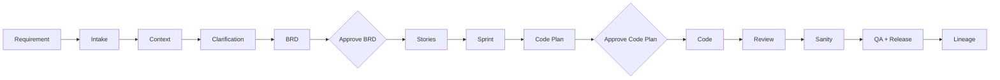
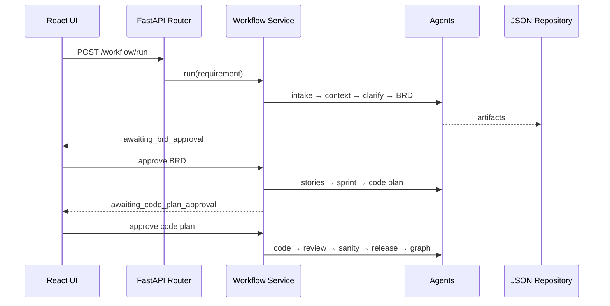
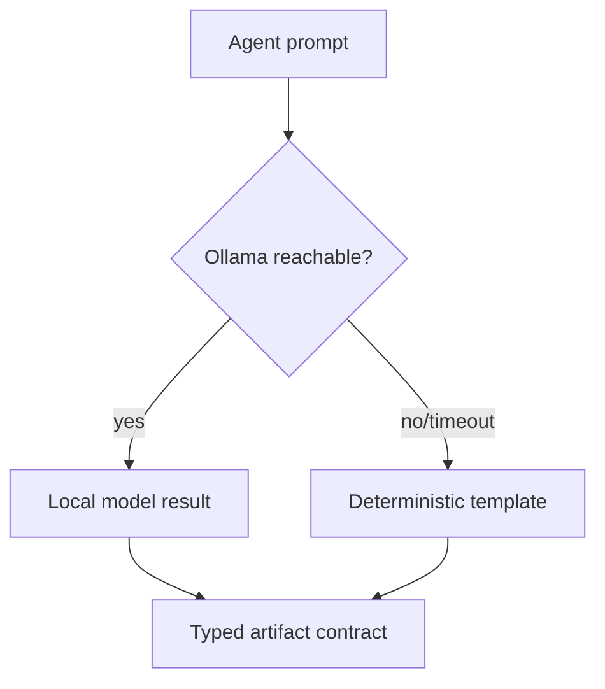
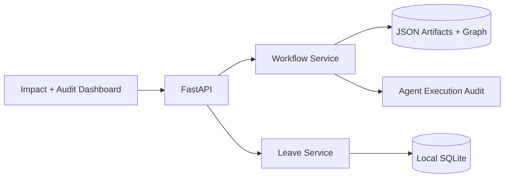

# Architecture

## One-page description
The React dashboard calls thin FastAPI routers. Routers delegate orchestration to `WorkflowService`; no business logic lives in controllers. Each typed agent accepts the previous artifact and produces JSON or Markdown. `JsonRepository` protects the artifact root and persists inspectable outputs. Two explicit state-machine gates prevent BRD decomposition and code generation without a human action. `LocalLLMClient` can call Ollama with a one-second timeout, while every workflow agent has a deterministic template so offline behavior is stable.

## End-to-end workflow

## Agent orchestration and data flow

## Before and after
| Before | After |
|---|---|
| Manual, disconnected documents | Repeatable agent-produced artifacts |
| Informal approvals | Enforced state-machine gates |
| Test/release context recreated | AC-linked review, sanity and QA handoff |
| Knowledge lost | JSON nodes and typed lineage edges |

## Approval gates
Gate 1 validates business intent before decomposition. Gate 2 validates architecture and AC-to-code mapping before generation. Invalid transitions return 409 and preserve state.

## Local LLM fallback

No cloud or paid API is needed. The PoC currently favors deterministic outputs; the adapter is ready for selectively enhanced prose.

## Traceability model
Nodes represent Requirement, BRD, Epic, Story, Acceptance Criteria, Code, Test, Review, Sanity, QA Handoff, and Release. Directed edges such as `GENERATES`, `IMPLEMENTED_BY`, and `VERIFIED_BY` explain lineage rather than merely ordering it.

## Storage and evaluator evidence
JSON remains the artifact system of record and powers the mock knowledge graph. The runnable leave feature uses Python's built-in SQLite driver with employees, requests, and append-only audit tables, proving local transactional persistence without adding a package. The workflow separately records ordered agent/human-gate events with UTC timestamps, outcomes, and execution duration. The UI converts this evidence into impact cards, approval state, an audit timeline, previews, and semantic lineage.

